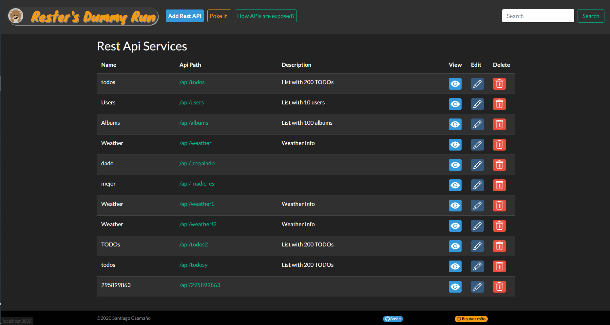

# Rester's Dummy Run

[TODO]

Gestiona todas tus apis Rest en un solo servidor de manera facil y sencilla.

Expone Json Dummys por api rest basadas en un Json de datos permitiendo usar
las operaciones GET POST PUT DELETE sobre esos datos o conjunto de datos

Posibilidad de configurar multiples APIs en un path determinado



## API methods
[TODO]

* /api/<your_api_path> [GET]
* /api/<your_api_path>/<element_number> [GET]
* /api/your_api_path [POST]
* /api/your_api_path [PUT]
* /api/<your_api_path>/<element_number> [DETETE]


## Postgres DB
DB_DIALECT=org.hibernate.dialect.PostgreSQLDialect
DB_DRIVER_CLASSNAME=org.postgresql.Driver
DB_URL=jdbc:postgresql://localhost:5432/rester
DB_USR=postgres
DB_PWD=postgres

## MariaDB
DB_DIALECT=org.hibernate.dialect.MariaDB103Dialect
DB_DRIVER_CLASSNAME=org.mariadb.jdbc.Driver
DB_URL=jdbc:mysql://localhost:3306/rester
DB_USR=root
DB_PWD=password

```
spring.datasource.url=${DB_URL:jdbc:h2:file:C:/temp/test}
spring.datasource.driverClassName=${DB_DRIVER_CLASSNAME:org.h2.Driver}
spring.datasource.username=${DB_USR:sa}
spring.datasource.password=${DB_PWD:}
spring.jpa.database-platform=${DB_DIALECT:org.hibernate.dialect.H2Dialect}
```

## Flyway Init Scripts
[TODO]

## Actuactor Endpoints
[TODO]

## Docker Image
[TODO]
